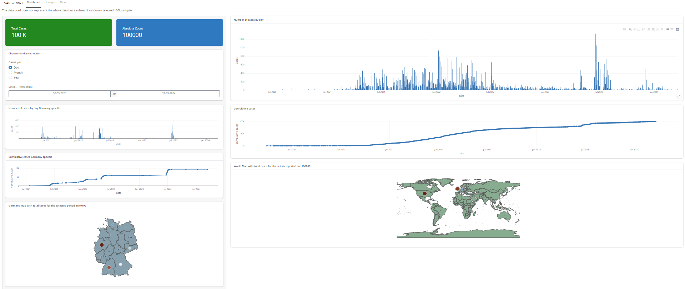

# SARS-CoV-2 | Shiny Dashboard
## [SARS-CoV-2]((https://hkjoon.shinyapps.io/sars-shiny-dashboard/)) - deployed at [Posit Cloud](https://hkjoon.shinyapps.io/sars-shiny-dashboard/)

<div align="center">
  
</div>

<br>
With the advancement of technologies, an enormous amount of data is being generated daily, and to understand and infer better results, we need to take advantage of modern technologies to handle and visualize the data.

Here, I have used Shiny for R to develop a Dashboard for the randomly selected 100K records for SARS-CoV-2 retrieved from [NCBI SARS-CoV-2 Data Hub](https://www.ncbi.nlm.nih.gov/labs/virus/vssi/#/virus?SeqType_s=Nucleotide&VirusLineage_ss=taxid:2697049). 

It has been tried to visualize the data for better understanding, and various filters have been incorporated to cater to user requirements. Multiple libraries were used for data processing and visualization

## Requirements

The project was developed with R 4.3.3 and RStudio RStudio 2023.12.0+369 "Ocean Storm"\
Shiny 1.8.1.1 was used for development along-with bslib 0.7.0 for customization.

#### Main Libraries
dplyr:1.1.4 – data pre-processing\
ggplot:3.5.0 - for visualization of plots\
plotly:4.10.4 – for interactivity of plots\
gisocR:0.4.2 – for Maps data \
DT:0.33 – for data tables

## Build
1. Install R and RStudio
2. Install the libraries.
3. Clone the repo.
   ```git
   git clone https://github.com/hemantjoon/sars-shiny-dashboard.git 
   ```
4. Launch the application
    ```r
    shiny::runApp()
    ```

## Shiny Developer
SARS-CoV-2 application is developed by [Hemant Kumar Joon](https://github.com/hemantjoon).\
[Linkedin](https://www.linkedin.com/in/hemantjoon/) | [ResearchGate](https://www.researchgate.net/profile/Hemant-Joon) | [Github](https://github.com/hemantjoon) |  [Portfolio](https://hemantjoon.github.io/)

Visit our [Shiny Application](https://hkjoon.shinyapps.io/sars-shiny-dashboard/)

## License

[Apache License 2.0](LICENSE)
